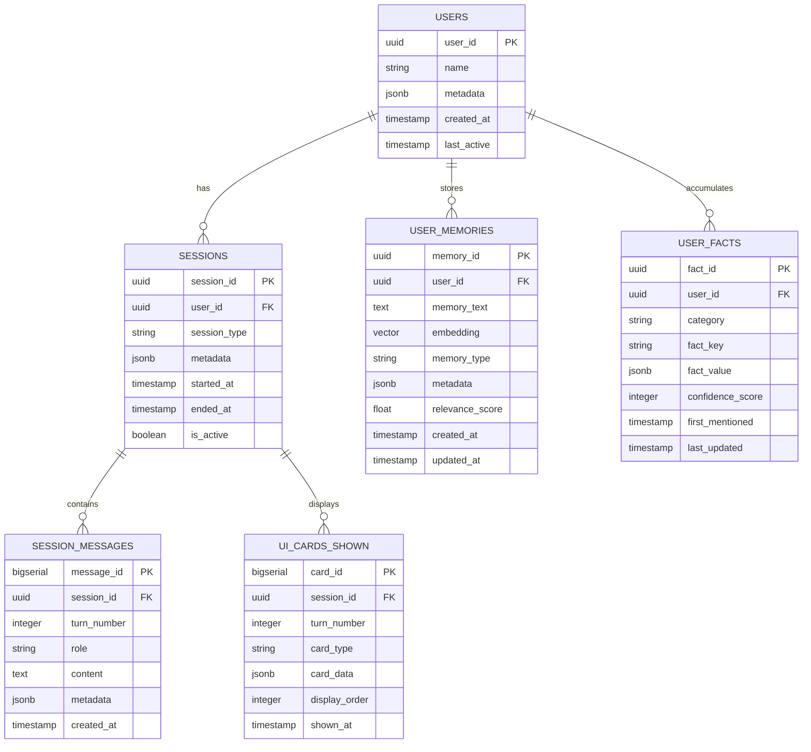

# Database Architecture: Dual-Layer Memory System

## Overview

This document outlines the comprehensive database architecture for implementing a production-grade dual-layer memory system combining:

1. **Zep-style Architecture**: Session-based conversation history with UI state replay
2. **Mem0 Architecture**: Cross-session user persona with vector-based semantic search

## Current State Analysis

### Existing Infrastructure

- ✅ PostgreSQL 16 with pgvector extension configured
- ✅ SQLAlchemy async engine setup with connection pooling
- ✅ Alembic for database migrations
- ✅ ChromaDB separate instance for knowledge base (keep as-is)
- ✅ Dependencies installed: `sqlalchemy`, `pgvector`, `psycopg[binary]`, `alembic`

### Design Considerations

- **Performance**: High-volume conversation data requires proper indexing
- **Scalability**: Separate tables for different concerns (normalization)
- **Vector Search**: pgvector integration for semantic similarity
- **Data Integrity**: Foreign keys and constraints
- **Query Patterns**: Optimized for session retrieval and user persona lookup

---

## Recommended Database Architecture

### Architecture Diagram



---

## Table Schemas

### 1. Users Table (Core Identity)

**Purpose**: Central user registry for identity management

```sql
CREATE TABLE users (
    user_id UUID PRIMARY KEY DEFAULT gen_random_uuid(),
    name VARCHAR(255),
    email VARCHAR(255) UNIQUE,
    metadata JSONB DEFAULT '{}',
    created_at TIMESTAMP WITH TIME ZONE DEFAULT NOW(),
    last_active TIMESTAMP WITH TIME ZONE DEFAULT NOW(),

    -- Indexes
    CONSTRAINT users_email_key UNIQUE (email)
);

CREATE INDEX idx_users_last_active ON users(last_active DESC);
CREATE INDEX idx_users_metadata ON users USING GIN(metadata);
```

**Key Design Decisions**:

- UUID for distributed scalability
- JSONB for flexible user attributes
- Last active timestamp for engagement tracking

---

### 2. Sessions Table (Zep Layer - Session Management)

**Purpose**: Track conversation sessions with temporal boundaries

```sql
CREATE TABLE sessions (
    session_id UUID PRIMARY KEY DEFAULT gen_random_uuid(),
    user_id UUID NOT NULL REFERENCES users(user_id) ON DELETE CASCADE,
    session_type VARCHAR(50) DEFAULT 'conversation', -- 'conversation', 'voice', 'ui_navigation'
    metadata JSONB DEFAULT '{}',
    started_at TIMESTAMP WITH TIME ZONE DEFAULT NOW(),
    ended_at TIMESTAMP WITH TIME ZONE,
    is_active BOOLEAN DEFAULT TRUE,

    -- Constraints
    CONSTRAINT sessions_user_fk FOREIGN KEY (user_id)
        REFERENCES users(user_id) ON DELETE CASCADE
);

-- Indexes for common queries
CREATE INDEX idx_sessions_user_active ON sessions(user_id, is_active);
CREATE INDEX idx_sessions_started_at ON sessions(started_at DESC);
CREATE INDEX idx_sessions_user_started ON sessions(user_id, started_at DESC);
```

**Key Design Decisions**:

- Explicit session lifecycle (started_at, ended_at)
- Session type for different interaction modes
- Cascade delete to clean up orphaned sessions

---

### 3. Session Messages Table (Zep Layer - Conversation Log)

**Purpose**: Complete conversation replay with turn-based ordering

```sql
CREATE TABLE session_messages (
    message_id BIGSERIAL PRIMARY KEY,
    session_id UUID NOT NULL REFERENCES sessions(session_id) ON DELETE CASCADE,
    turn_number INTEGER NOT NULL,
    role VARCHAR(20) NOT NULL CHECK (role IN ('user', 'assistant', 'system')),
    content TEXT NOT NULL,
    metadata JSONB DEFAULT '{}',
    created_at TIMESTAMP WITH TIME ZONE DEFAULT NOW(),

    -- Constraints
    CONSTRAINT session_messages_session_fk FOREIGN KEY (session_id)
        REFERENCES sessions(session_id) ON DELETE CASCADE,
    CONSTRAINT unique_session_turn UNIQUE (session_id, turn_number)
);

-- Composite index for ordered retrieval
CREATE INDEX idx_messages_session_turn ON session_messages(session_id, turn_number);
CREATE INDEX idx_messages_session_created ON session_messages(session_id, created_at);
CREATE INDEX idx_messages_role ON session_messages(role);
```

**Key Design Decisions**:

- BIGSERIAL for high-volume message IDs
- Turn number for deterministic ordering
- Unique constraint prevents duplicate turns
- Metadata for extensibility (confidence scores, token counts, etc.)

---

### 4. UI Cards Shown Table (Zep Layer - UI State Replay)

**Purpose**: Track UI cards shown at each conversation turn for voice navigation

```sql
CREATE TABLE ui_cards_shown (
    card_id BIGSERIAL PRIMARY KEY,
    session_id UUID NOT NULL REFERENCES sessions(session_id) ON DELETE CASCADE,
    turn_number INTEGER NOT NULL,
    card_type VARCHAR(100) NOT NULL, -- 'product_card', 'comparison_table', 'chart', etc.
    card_data JSONB NOT NULL,
    display_order INTEGER NOT NULL, -- Order within the same turn
    shown_at TIMESTAMP WITH TIME ZONE DEFAULT NOW(),

    -- Constraints
    CONSTRAINT ui_cards_session_fk FOREIGN KEY (session_id)
        REFERENCES sessions(session_id) ON DELETE CASCADE,
    CONSTRAINT unique_card_display UNIQUE (session_id, turn_number, display_order)
);

-- Indexes for voice navigation queries
CREATE INDEX idx_cards_session_turn ON ui_cards_shown(session_id, turn_number);
CREATE INDEX idx_cards_type ON ui_cards_shown(card_type);
CREATE INDEX idx_cards_data ON ui_cards_shown USING GIN(card_data);
```

**Key Design Decisions**:

- Separate from messages for normalized design
- Display order for multiple cards per turn
- JSONB stores full card data for reconstruction
- GIN index on card_data for searching within JSON

**Example Voice Navigation Query**:

```sql
-- "Show me the second card from 3 questions ago"
SELECT card_data
FROM ui_cards_shown
WHERE session_id = :session_id
  AND turn_number = (SELECT MAX(turn_number) - 3 FROM session_messages WHERE session_id = :session_id)
  AND display_order = 2;
```

---

### 5. User Memories Table (Mem0 Layer - Vector Storage)

**Purpose**: Semantic memory with vector embeddings for similarity search

```sql
-- Enable pgvector extension (run once)
CREATE EXTENSION IF NOT EXISTS vector;

CREATE TABLE user_memories (
    memory_id UUID PRIMARY KEY DEFAULT gen_random_uuid(),
    user_id UUID NOT NULL REFERENCES users(user_id) ON DELETE CASCADE,
    memory_text TEXT NOT NULL,
    embedding vector(1536), -- OpenAI text-embedding-3-small dimension
    memory_type VARCHAR(50) DEFAULT 'conversation', -- 'fact', 'preference', 'conversation', 'skill'
    metadata JSONB DEFAULT '{}',
    relevance_score FLOAT DEFAULT 1.0,
    created_at TIMESTAMP WITH TIME ZONE DEFAULT NOW(),
    updated_at TIMESTAMP WITH TIME ZONE DEFAULT NOW(),

    -- Constraints
    CONSTRAINT user_memories_user_fk FOREIGN KEY (user_id)
        REFERENCES users(user_id) ON DELETE CASCADE
);

-- Vector similarity index (HNSW for fast approximate search)
CREATE INDEX idx_memories_embedding ON user_memories
    USING hnsw (embedding vector_cosine_ops)
    WITH (m = 16, ef_construction = 64);

-- Standard indexes
CREATE INDEX idx_memories_user_type ON user_memories(user_id, memory_type);
CREATE INDEX idx_memories_created ON user_memories(created_at DESC);
CREATE INDEX idx_memories_metadata ON user_memories USING GIN(metadata);
```

**Key Design Decisions**:

- **Vector dimension 1536**: Standard for OpenAI embeddings (change if using different model)
- **HNSW index**: Hierarchical Navigable Small World for O(log n) vector search
- **Cosine similarity**: Most common for text embeddings
- Relevance score for weighted retrieval

**Semantic Search Query**:

```sql
-- Find top 5 similar memories
SELECT
    memory_text,
    1 - (embedding <=> :query_embedding) AS similarity
FROM user_memories
WHERE user_id = :user_id
ORDER BY embedding <=> :query_embedding
LIMIT 5;
```

---

### 6. User Facts Table (Mem0 Layer - Structured Persona)

**Purpose**: Extracted structured facts about users (name, preferences, skills, etc.)

```sql
CREATE TABLE user_facts (
    fact_id UUID PRIMARY KEY DEFAULT gen_random_uuid(),
    user_id UUID NOT NULL REFERENCES users(user_id) ON DELETE CASCADE,
    category VARCHAR(100) NOT NULL, -- 'personal', 'professional', 'preference', 'interest'
    fact_key VARCHAR(255) NOT NULL,
    fact_value JSONB NOT NULL,
    confidence_score INTEGER CHECK (confidence_score BETWEEN 0 AND 100),
    source_memory_id UUID REFERENCES user_memories(memory_id) ON DELETE SET NULL,
    first_mentioned TIMESTAMP WITH TIME ZONE DEFAULT NOW(),
    last_updated TIMESTAMP WITH TIME ZONE DEFAULT NOW(),

    -- Constraints
    CONSTRAINT user_facts_user_fk FOREIGN KEY (user_id)
        REFERENCES users(user_id) ON DELETE CASCADE,
    CONSTRAINT unique_user_fact UNIQUE (user_id, category, fact_key)
);

-- Indexes for fact lookups
CREATE INDEX idx_facts_user_category ON user_facts(user_id, category);
CREATE INDEX idx_facts_updated ON user_facts(last_updated DESC);
CREATE INDEX idx_facts_value ON user_facts USING GIN(fact_value);
```

**Key Design Decisions**:

- Normalized fact storage (not just JSONB blob)
- Confidence scoring for fact uncertainty
- Link to source memory for traceability
- Unique constraint prevents duplicate facts

**Example Facts**:

```json
{
  "user_id": "123",
  "category": "professional",
  "fact_key": "role",
  "fact_value": { "title": "React Developer", "years_experience": 5 },
  "confidence_score": 95
}
```

---

## Index Strategy Summary

### Performance Optimization

| Table              | Index Type       | Purpose                    | Query Pattern                               |
| ------------------ | ---------------- | -------------------------- | ------------------------------------------- |
| `sessions`         | B-tree composite | Active sessions per user   | `WHERE user_id = ? AND is_active = true`    |
| `session_messages` | B-tree composite | Ordered message retrieval  | `WHERE session_id = ? ORDER BY turn_number` |
| `ui_cards_shown`   | B-tree composite | Voice navigation lookup    | `WHERE session_id = ? AND turn_number = ?`  |
| `user_memories`    | HNSW vector      | Semantic similarity search | `ORDER BY embedding <=> ?`                  |
| `user_facts`       | B-tree composite | Fact category lookup       | `WHERE user_id = ? AND category = ?`        |
| All JSONB columns  | GIN              | Metadata search            | `WHERE metadata @> '{"key": "value"}'`      |

---

## Data Relationships & Constraints

### Cascade Rules

- **Users → Sessions**: `ON DELETE CASCADE` (delete all user sessions)
- **Sessions → Messages**: `ON DELETE CASCADE` (delete all session data)
- **Sessions → UI Cards**: `ON DELETE CASCADE` (cleanup UI history)
- **Users → Memories**: `ON DELETE CASCADE` (GDPR compliance)
- **Memories → Facts**: `ON DELETE SET NULL` (preserve facts even if source deleted)

### Referential Integrity

- All foreign keys enforced at database level
- Unique constraints prevent duplicate data
- Check constraints validate enum-like fields

---

## Storage Estimates

### Assumptions

- Average conversation: 20 turns (40 messages)
- Average message: 500 characters
- Average UI card: 2KB JSON
- Embedding: 6KB per vector (1536 floats × 4 bytes)

### Projected Storage (per 1,000 users)

| Table            | Records | Size per Record | Total Size |
| ---------------- | ------- | --------------- | ---------- |
| Users            | 1,000   | 1KB             | ~1MB       |
| Sessions         | 5,000   | 500B            | ~2.5MB     |
| Session Messages | 200,000 | 600B            | ~120MB     |
| UI Cards Shown   | 100,000 | 2KB             | ~200MB     |
| User Memories    | 50,000  | 7KB             | ~350MB     |
| User Facts       | 10,000  | 500B            | ~5MB       |
| **TOTAL**        |         |                 | **~678MB** |

**Scaling**: At 100K users, estimate ~68GB total storage.

---

## Migration Plan

### Phase 1: Core Tables

1. Create `users` table
2. Create `sessions` table with FK to users
3. Create `session_messages` table with FK to sessions
4. Create `ui_cards_shown` table with FK to sessions

### Phase 2: Vector Extension

1. Enable pgvector extension
2. Create `user_memories` table with vector column
3. Create HNSW index on embeddings

### Phase 3: Structured Facts

1. Create `user_facts` table
2. Add optional FK to `user_memories`

### Phase 4: Optimization

1. Add all secondary indexes
2. Configure autovacuum settings
3. Set up monitoring for index usage

---

## Recommended SQLAlchemy Models

### Example Model Structure

```python
from sqlalchemy import Column, String, Integer, Boolean, DateTime, Text, ForeignKey, CheckConstraint, Float
from sqlalchemy.dialects.postgresql import UUID, JSONB
from sqlalchemy.orm import relationship
from pgvector.sqlalchemy import Vector
from datetime import datetime
import uuid

class User(Base):
    __tablename__ = "users"

    user_id = Column(UUID(as_uuid=True), primary_key=True, default=uuid.uuid4)
    name = Column(String(255))
    email = Column(String(255), unique=True)
    metadata = Column(JSONB, default={})
    created_at = Column(DateTime(timezone=True), default=datetime.utcnow)
    last_active = Column(DateTime(timezone=True), default=datetime.utcnow)

    # Relationships
    sessions = relationship("Session", back_populates="user", cascade="all, delete-orphan")
    memories = relationship("UserMemory", back_populates="user", cascade="all, delete-orphan")
    facts = relationship("UserFact", back_populates="user", cascade="all, delete-orphan")

class Session(Base):
    __tablename__ = "sessions"

    session_id = Column(UUID(as_uuid=True), primary_key=True, default=uuid.uuid4)
    user_id = Column(UUID(as_uuid=True), ForeignKey("users.user_id", ondelete="CASCADE"), nullable=False)
    session_type = Column(String(50), default="conversation")
    metadata = Column(JSONB, default={})
    started_at = Column(DateTime(timezone=True), default=datetime.utcnow)
    ended_at = Column(DateTime(timezone=True))
    is_active = Column(Boolean, default=True)

    # Relationships
    user = relationship("User", back_populates="sessions")
    messages = relationship("SessionMessage", back_populates="session", cascade="all, delete-orphan")
    ui_cards = relationship("UICardShown", back_populates="session", cascade="all, delete-orphan")

class SessionMessage(Base):
    __tablename__ = "session_messages"

    message_id = Column(Integer, primary_key=True, autoincrement=True)
    session_id = Column(UUID(as_uuid=True), ForeignKey("sessions.session_id", ondelete="CASCADE"), nullable=False)
    turn_number = Column(Integer, nullable=False)
    role = Column(String(20), CheckConstraint("role IN ('user', 'assistant', 'system')"), nullable=False)
    content = Column(Text, nullable=False)
    metadata = Column(JSONB, default={})
    created_at = Column(DateTime(timezone=True), default=datetime.utcnow)

    # Relationships
    session = relationship("Session", back_populates="messages")

class UICardShown(Base):
    __tablename__ = "ui_cards_shown"

    card_id = Column(Integer, primary_key=True, autoincrement=True)
    session_id = Column(UUID(as_uuid=True), ForeignKey("sessions.session_id", ondelete="CASCADE"), nullable=False)
    turn_number = Column(Integer, nullable=False)
    card_type = Column(String(100), nullable=False)
    card_data = Column(JSONB, nullable=False)
    display_order = Column(Integer, nullable=False)
    shown_at = Column(DateTime(timezone=True), default=datetime.utcnow)

    # Relationships
    session = relationship("Session", back_populates="ui_cards")

class UserMemory(Base):
    __tablename__ = "user_memories"

    memory_id = Column(UUID(as_uuid=True), primary_key=True, default=uuid.uuid4)
    user_id = Column(UUID(as_uuid=True), ForeignKey("users.user_id", ondelete="CASCADE"), nullable=False)
    memory_text = Column(Text, nullable=False)
    embedding = Column(Vector(1536))  # pgvector
    memory_type = Column(String(50), default="conversation")
    metadata = Column(JSONB, default={})
    relevance_score = Column(Float, default=1.0)
    created_at = Column(DateTime(timezone=True), default=datetime.utcnow)
    updated_at = Column(DateTime(timezone=True), default=datetime.utcnow, onupdate=datetime.utcnow)

    # Relationships
    user = relationship("User", back_populates="memories")

class UserFact(Base):
    __tablename__ = "user_facts"

    fact_id = Column(UUID(as_uuid=True), primary_key=True, default=uuid.uuid4)
    user_id = Column(UUID(as_uuid=True), ForeignKey("users.user_id", ondelete="CASCADE"), nullable=False)
    category = Column(String(100), nullable=False)
    fact_key = Column(String(255), nullable=False)
    fact_value = Column(JSONB, nullable=False)
    confidence_score = Column(Integer, CheckConstraint("confidence_score BETWEEN 0 AND 100"))
    source_memory_id = Column(UUID(as_uuid=True), ForeignKey("user_memories.memory_id", ondelete="SET NULL"))
    first_mentioned = Column(DateTime(timezone=True), default=datetime.utcnow)
    last_updated = Column(DateTime(timezone=True), default=datetime.utcnow, onupdate=datetime.utcnow)

    # Relationships
    user = relationship("User", back_populates="facts")
```

---

## Service Layer Design

### Recommended Service Structure

```
src/services/memory/
├── __init__.py
├── session_svc.py       # Zep layer: Session & message management
├── persona_svc.py       # Mem0 layer: Vector memories & facts
└── dual_layer_svc.py    # Unified interface combining both
```

### Key Methods

**SessionService** (Zep Layer):

- `create_session(user_id) → session_id`
- `append_message(session_id, role, content, ui_cards)`
- `get_session_history(session_id, last_n=10)`
- `get_ui_card_at_turn(session_id, turn_number, card_order)`
- `end_session(session_id)`

**PersonaService** (Mem0 Layer):

- `add_memory(user_id, text, embedding, memory_type)`
- `search_memories(user_id, query_embedding, top_k=5)`
- `extract_and_store_fact(user_id, category, key, value, confidence)`
- `get_user_profile(user_id) → Dict[category, facts]`
- `update_fact_confidence(fact_id, new_score)`

**DualLayerMemory** (Unified):

- `initialize_user(name, email)`
- `start_conversation(user_id) → session_id`
- `process_turn(session_id, user_message, assistant_message, ui_cards)`
- `get_context_for_llm(user_id, session_id) → str (formatted prompt)`

---

## Alternative Considerations

### Why NOT Use Separate Vector DB?

| Option                | Pros                                                       | Cons                                    | Decision                          |
| --------------------- | ---------------------------------------------------------- | --------------------------------------- | --------------------------------- |
| **pgvector (chosen)** | ✅ Single database<br>✅ ACID guarantees<br>✅ Simpler ops | ⚠️ Slightly slower than specialized DBs | ✅ **RECOMMENDED**                |
| Pinecone              | ✅ Fastest vector search<br>✅ Managed service             | ❌ Extra cost<br>❌ Data silos          | ❌ Overkill for 100K users        |
| Qdrant                | ✅ Fast & open-source                                      | ❌ Another service to manage            | ❌ Unnecessary complexity         |
| Redis Vector          | ✅ In-memory speed                                         | ❌ Data persistence concerns            | ❌ Not suitable for critical data |

**Verdict**: pgvector is optimal for your scale (< 1M memories).

---

## Implementation Checklist

### Database Setup

- [ ] Update `posgress_pgvector.yml` with correct credentials
- [ ] Create initialization script in `initdb/01_enable_vector.sql`
- [ ] Configure connection pooling parameters

### Schema Creation

- [ ] Create Alembic migration for `users` table
- [ ] Create Alembic migration for `sessions` + `session_messages`
- [ ] Create Alembic migration for `ui_cards_shown`
- [ ] Create Alembic migration for `user_memories` with vector extension
- [ ] Create Alembic migration for `user_facts`
- [ ] Create all indexes in separate migration

### SQLAlchemy Models

- [ ] Define all models in `src/api/models/db_schemas.py`
- [ ] Add relationship definitions
- [ ] Configure cascade behaviors

### Service Layer

- [ ] Implement `SessionService` with async methods
- [ ] Implement `PersonaService` with vector search
- [ ] Implement `DualLayerMemory` facade
- [ ] Add unit tests for each service

### Integration

- [ ] Update agent initialization to use `DualLayerMemory`
- [ ] Add memory context injection to LLM prompts
- [ ] Implement voice navigation function tool
- [ ] Create API endpoints for history/persona retrieval

---

## Verification Plan

### Automated Tests

1. **Session Tests**:
   - Create session → append 5 messages → verify retrieval order
   - Test UI card storage and retrieval by turn number
   - Verify cascade delete when session is deleted

2. **Vector Search Tests**:
   - Insert 10 memories with embeddings
   - Query with similar embedding
   - Verify top-5 results ordered by similarity

3. **Fact Extraction Tests**:
   - Store fact "role: Python Developer"
   - Update with "role: Senior Python Developer"
   - Verify unique constraint and conflict resolution

### Manual Verification

1. **Full Conversation Flow**:
   - Start session → 5 turns with UI cards → end session
   - Query API: `GET /api/history/{session_id}`
   - Verify all cards are reconstructable

2. **Cross-Session Persistence**:
   - Session 1: "I'm a React developer"
   - Session 2: Ask "What do you know about me?"
   - Verify persona facts retrieved from `user_facts`

3. **Voice Navigation**:
   - Have 3-turn conversation
   - Say: "Show me the second card from the first question"
   - Verify correct card_data returned

---

## Next Steps

1. **Review this plan** and confirm the architecture aligns with your requirements
2. **Clarify any questions**:
   - Is the embedding dimension 1536 correct? (or using different model?)
   - Do you need multi-tenancy features?
   - Any specific compliance requirements (GDPR, data retention)?
3. **Approval to proceed** with creating Alembic migrations and SQLAlchemy models
